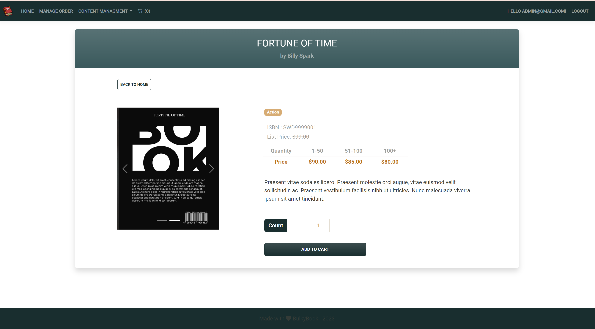

# BulkyBook
 ASP NET MVC Core (.NET 8), ASP NET Core (.NET 8) Razor Project, Dependency Injection, Entity Framework Core, SQL Server, CRUD Operations. 
## Overview
--------------------------------------------------------
Bulky Book is an online store where users can view product information, register/login using Facebook and Microsoft, add products to cart, place an order, receive discounts and make payments. Users can place an order as a company or as an individual user.
The administrator and employees can view users, block and create user accounts, perform CRUD operations on products and categories, view customer orders, and more.

https://bulkymvc-dotnetmaster.azurewebsites.net                               
Admin username: admin@gmail.com                                  
Admin password: Admin123*

## Available roles
--------------------------------------------------------
- Admin
- Employee
- Company Users
- Cuctomer

## Display User Interface
--------------------------------------------------------
### Registration page where data is validated. User can register himself or use Facebook or Microsoft. The same situation when the user wants to log in

### Home Screen displays list of products and link to view individual product details

.png)
.png)

### Users can see the details of the product, i.e. all its images, description, prices with different discounts, etc

### Users can view products in shopping carts and add or remove them from cart

### View a summary of orders for products with the shipping details and order summary

### Order confirmation after payment using Stripe

### The administrator can access the page of lists of products, categories, companies for CRUD operations

.png)

### Admin can Manage Orders, change their status and payment

.png)

